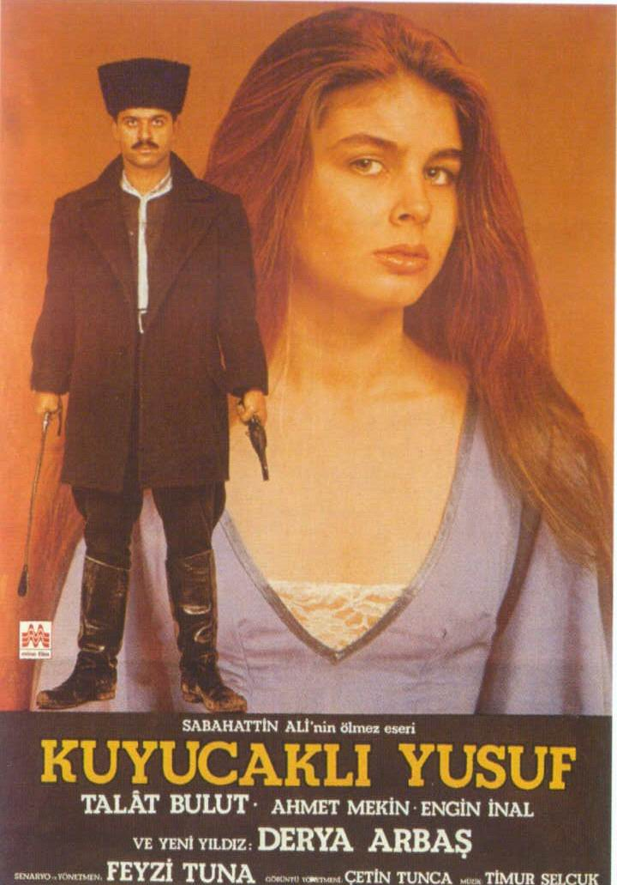

# Kuyucaklı Yusuf 

**Kuyucaklı Yusuf**, o zamana kadar bir öykü yazarı olarak tanınan [Sabahattin Ali](https://tr.wikipedia.org/wiki/Sabahattin_Ali)'nin 1937 yılında kaleme aldığı ve yayımladığı ilk romanıdır. Romanın baş kahramanı olan Yusuf, Türk edebiyatının en romantik karakterlerinden birisi olarak kabul edilir. Roman, Millî Eğitim Bakanlığı’nın ortaöğretim öğrencilerine tavsiye ettiği "100 Temel Eser" listesinde yer almaktadır. 

Roman, 1985 yılında [Feyzi Tuna](https://tr.wikipedia.org/wiki/Feyzi_Tuna) tarafından aynı adla sinemaya uyarlandı.
  

## Konusu

1903 yılının yağmurlu bir sonbahar gecesinde Aydın ilinin Nazilli ilçesinin Kuyucak köyünde bir karı kocanın öldürülmesi olayını soruşturmaya giden Nazilli Kaymakamı Salahattin Bey, anne babası gözleri önünde katledilmiş olan 9 yaşındaki Yusuf'u, evlatlık olarak alıp evine götürür.[^1]

Salahattin Bey, kendisinden 15 yaş küçük olan Şahinde Hanım ile evlidir. Hem yaş farkı, hem de mizaç bakımından uyuşmazlık yaşadığı eşiyle zor yürüttüğü ilişkisi, Yusuf’u eve getirmesiyle daha da bozulur. Şahinde, kocasının eve getirdiği bu köylü çocuğunu sevmez ve benimsemez. Yusuf, evin küçük kızı Muazzez ile birlikte, karı koca arasındaki huzursuzluğun içinde büyür. Salahattin Bey'in, Yusuf’u eve getirişinden bir yıl sonra Edremit'e tayini atanır. Yusuf, evdeki karı koca kavgalarının getirdiği huzursuzluğa rağmen, Edremit’te mutlu bir çocukluk geçirir.

19 yaşına gelen Yusuf, bir bayram günü, kaymakamın kızı Muazzez'e kasaba eşrafından Hilmi Bey'in oğlu Şakir'in sataşması üzerine onunla kavga eder. Bu olay sonucu kasabanın en zengini olan fabrikatör Hilmi Bey’in gücü ile karşı karşıya gelir. Şakir, bayram yerindeki olaydan bir süre önce Kübra adında bir genç kıza tecavüz etmiştir. Şakir, babası ve Hacı Ethem Bey’in tertibi ile Kübra ve annesini de kullanarak suçu Yusuf’a yüklemeye çalışır. Ancak Kübra’nın itirafı sonucu plan başarısız olur. Yusuf tarafından korunan Kübra ve annesi, kaymakamın zeytinliğinde çalışmaya başlar; bu durum Şakir’in Yusuf’a kinini arttırır.

İlk defa bir genç kıza gösterdiği ilgisi ters karşılanan Şakir, Yusuf’la kavgasından sonra Muazzez’le evlenmek ister. Babası Hilmi Bey, evliliğe kaymakamı ikna etmek için yeni bir plan yapar. Salahattin Bey’i hileli bir kumar oyununa dahil ederek borçlandırır. İmzalattığı senetler karşılığında Muazzez’i oğlu Şakir’e ister. Şahinde Hanım, kızını Şakir ile evlendirme düşüncesini sevinçle karşılar fakat Selahattin Bey işi sürüncemede bırakır; Kübra’ya Şakir’in tecavüz ettiğini öğrenince, borcu ödeyip kızını Şakir’le evlenmekten kurtarmanın yollarını arar.

Yusuf, esnaf arkadaşı olan Ali’den para alarak kaymakamın borcunu kapatır ve karşılığında Muazzez’i onunla evlendirmeyi düşünür. Muazzez ise Yusuf’u sevdiği için Ali ile evlenmeye yanaşmaz. Yusuf, Ali’ye Muazzez’in onunla evlenmek istemediğini söyleyemeyip zeytinliğe kapanır. Şakir, evlilik hazırlıklarına başlayan Ali’yi, bir arkadaşlarının düğününde bütün kasabanın gözü önünde öldürür. Güçlüden yana olan kasaba halkı, el birliği ile bu cinayeti örtbas eder.

Şakir’in Muazzez ile evlenme düşüncesi Şahinde Hanım’ın da teşviki ile yeniden canlanır. Bunu öğrenen Yusuf, Muazzez’i kaçırıp onunla evlenir. Yusuf, tahrirat katibi olarak kaymakamlıkta işe girer. Bir akşam, kalbinden rahatsızlanan Salahattin Bey ölür. Yeni atanan Kaymakam İzzet Bey, Şakir ve Hilmi Bey’in oyuncağı gibidir; onların isteğiyle Yusuf'u masabaşı işten alıp süvari tahsildarı yapar. O köy köy gezerken, Muazzez annesinin ısrarları ve paranın cazibesi sonucu eşraf ve bürokratların evlerindeki içki âlemlerine katılır, alkole alışır ve kendi evlerinde içki âlemleri düzenler. Durumdan şüphelenen Yusuf, bir gece habersiz çıkıp gelir. Gördüğü durum karşısında çılgına dönerek, her yana gelişigüzel ateş eder. Yanlışlıkla Muazzez’i vurur, onun yaralandığının farkında olmayarak onu atına atıp kaçırır.

Muazzez yolda ölür. Yusuf, karısını kendi elleriyle gömer ve atını dağlara doğru sürer.

   
### Kaynakça

[^1]: [Sabahattin Ali’nin Romanlarında Aydınlar](http://kybele.anadolu.edu.tr/makaleler/sb2001_1_1/153757.pdf)