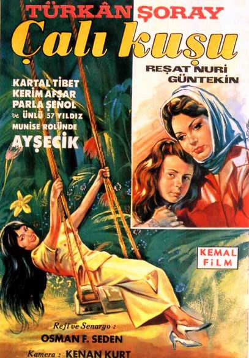

# Çalıkuşu 

**Çalıkuşu**, Reşat Nuri Güntekin'in ilk defa 1922'de tefrika edilmeye başlanıp 1923'te kitap olarak yayımlanan, 1937'de büyük değişikliklerle tefrika edilen romanıdır.[^1] 

Romanda, İstanbul'da köklü bir ailenin kızı olan çocuk ruhlu Feride'nin çok sevdiği nişanlısı tarafından ihanete uğramasıyla kendini öğretmenlik mesleğine adaması ve hayatını kazanabilmek için Anadolu'da şehir şehir dolaşması anlatılır. Melodram ögeleri ile yüklü bir aşk öyküsünün yanı sıra bürokrasi eleştirisi, kadınların Osmanlı toplumunda var olma mücadelesi, öğretmenlik mesleğinin icrası gibi pek çok konuyu ele alır.

Eserin sinema, televizyon dizisi, tiyatro ve bale uyarlamaları vardır.
  

## Konusu

Bir hatıra defteri olarak düzenlenmiş olan romanda Feride, kendisine yabancı bir şehirde, bir otel odasında anılarını yazarken geriye dönerek, çocukluk ve ilk genç kızlık dönemlerini anlatır.

İstanbullu bir subayın kızı olan Feride, küçük yaşta annesini kaybetmiştir; yanına gönderildiği babaannesinin de ölümü üzerine "Notre Dame de Sion" Fransız yatılı okulunda okur. Yaramazlıkları yüzünden arkadaşları, okulda, ona "Çalıkuşu" adını takarlar.

Feride, yaz tatillerini Besime teyzesinin köşkünde geçirir. Teyzesinin yakışıklı oğlu Kâmran ile birbirlerini severler ve nişanlanırlar. Feride'nin de desteklemesiyle Kâmran, üç yıl Avrupa'da bir elçilikte görev yaptıktan sonra döner. Bu arada okulunu bitiren Feride ile düğün hazırlıkları yaparlar. Feride, düğün günü, bir kadının getirdiği mektuptan Kamran'ın İsviçre'de iken Münevver adında hasta bir kızla ilişkisi olduğunu, ona evlenme sözü verdiğini öğrenir, her şeyi yüzüstü bırakıp kaçar.

Anadolu'da öğretmenlik yaparak Kamran'ı unutmak isteyen Feride, İstanbul rüştiyelerinde öğretmenlik teklifini kabul etmez; tüm zorluklara ve bürokratik engellere rağmen, istediğini elde eder ve İstanbul’dan ayrılır. Anadolu'nun çeşitli yerlerinde öğretmenlik yapan Feride, idealist bir eğitimcidir ancak gittiği yerlerde güzelliği başına bela olur; hakkında çeşitli dedikodular çıkar.

İlk öğretmenlik deneyimi, Zeyniler köyü denilen, hiçbir öğretmenin gitmeyi kabul etmediği kuş uçmaz kervan geçmez yerdedir. Zeyniler'de evlat edinip yanına aldığı Munise'ye bütün sevgisini verir. Kuşadası'nda öğretmenlik yaparken savaş başlar; okul hastaneye çevrilir ve Feride hastabakıcılık yapmaya başlar. Kuşadası'ndaki hastaneye başhekim olarak Zeyniler Köyü'nde iken tanıştığı Doktor Hayrullah Bey atanmıştır. Beş yıl sonra okullar yeniden açılır. Babacan bir adam olan Hayrullah Bey, emekli olup Kuşadası'na yerleşir ve Feride'yi kızı gibi korur. Munise'nin kuşpalazına yakalanıp ölmesinden sonra hastalanan Feride, Hayrullah Bey ile kalır. Halkın dedikodusu üzerine onunla kâğıt üzerinde evlenirler; fakat aralarında sadece "baba – kız" ilişkisi vardır.

Feride, öğretmenliğe başlayınca bir "günlük" tutmuş, başından geçen her şeyi günü gününe bir deftere yazmıştır. Hayrullah Bey bu defteri bulur, okur ve saklar. Hastalanınca, Feride'ye kendisinin ölümünden sonra ara sıra teyzesinin yanına gitmesini ve verdiği kapalı zarfı Kâmran'a teslim etmesini vasiyet eder.

Kısa bir süre sonra Hayrullah Bey, bütün mal varlığını Feride'ye bırakarak ölür. Hayrullah Bey'in ölümünden sonra, vasiyeti yerine getirilir. Feride, zarfı Kâmran'a verir. Zarfın içinde Hayrullah Bey’in bir mektubu ile Feride'nin günlüğü vardır. Hayrullah Bey, Kâmran'a yazdığı mektupta Feride'yi bir daha bırakmamasını salık vermektedir. Kâmran Feride'nin günlüğünü sabaha dek okur, her şeyi öğrenir. Ertesi gün gidecek olan Feride'yi bırakmaz ve evlenirler.

   
### Kaynakça

[^1]: Abir, Nihan. ["Çalıkuşu'nun hikâyesi"](https://tez.yok.gov.tr/UlusalTezMerkezi/TezGoster?key=vVNzTGHHhjH-u3WMToxQ-oxY0_awnp9qK14bs7tDVYD4Hekyl-vr9fGg54d9jxgJ). https://tez.yok.gov.tr/. Mimar Sinan Güzel Sanatlar Üniversitesi Sosyal Bilimler Enstitüsü Yüksek Lisans Tezi 2012